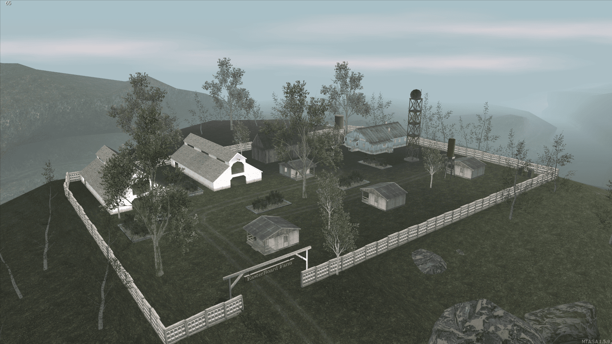
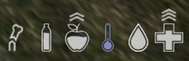

# Changelog - 1.0

## **ADICIONADO**:

- **Safe-Zone**:

  - Um local seguro para interagir com outros jogadores e fazer negociações com jogadores ou NPC's.

    - _Obs: Não é possível atirar, mirar, sofrer dano ou remover outros jogadores de veículos enquanto estiver dentro de uma safe-zone._
    - _Obs: Nós não nos responsabilizamos por possíveis campers que possam agir nas redondezas; a zona é bem extensa, você deve tomar cuidado para chegar até lá._

   

  

    
  

- **Traders**:

  - NPC's negociantes que ficam dentro da safe-zone. Eles aceitam uma nova moeda chamada "Gold".
    Cada trader possui sua própria carteira e seu próprio estoque. Ou seja, os traders irão revender os itens que compraram de outros jogadores, e caso o seu dinheiro acabe, eles não podem comprar mais nenhum item até que outro jogador compre algum item deles. A mesma lógica é aplicada no estoque; caso seus estoques sejam esgotados, eles só poderão vender após comprar o item de outro jogador.

- **Traders (Mercado Negro)**:

  - Funcionam da mesma maneira que os negociantes comuns, a única diferença é que aparecem em locais aleatórios no mapa (principalmente fora da safe-zone), e eles negociam os itens mais raros.
    - Obs: Eles podem enviar mensagens através do *Rádio Comunicador* informando suas localizações.

- **Novas Bases**:

  - Base 11 (Categoria 1).
  - Base 12 (Categoria 1).
  - Base 13 (Categoria 1).
  - Base 6 (Categoria 3).
  - Base 9 (Categoria 4).

- **Novas variedades de itens ao nascer**.
- **Indicadores na HUD mostrando se os status subiram ou desceram**.
  

    
  

---

## **CORRIGIDO**:

- Diversos bugs de renderização de construções.
- Bug que fazia o jogador "travar" ao utilizar um medicamento ou realizar algumas outras ações específicas.
- Diversas colisões de objetos foram **otimizadas**.

---

## **ALTERADO**:

- Agora não é mais possível remover as peças de um veículo caso ele esteja em movimento.
- Agora não é mais possível abastecer veículos em movimento.
- Diminuído o tamanho da _Caixa de Madeira_ no inventário.
- Agora as _Minas Terrestres_ explodirão ao serem atingidas por tiros.
- Houveram diversas mudanças em diversos locais do mapa, principalmente na vegetação.

---

## **REMOVIDO**:

- Radiação em Bayside.

---

[Anterior](https://google.com)

[Próximo](https://google.com)
